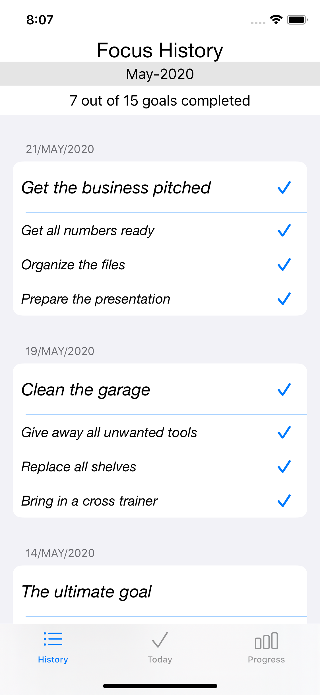

#  OpenClassrooms - iOS development path - iOS Project 7
## FocusOn - portrait (iPhones and iPads)
## Core Data - User Notifications - Charts (CocoaPods)

This is a todo list app. 
It consists of three screen tabs:
1. Today
2. History
3. Progress

## Launch Screen

 

## Today
This screen is the initial one the user will first see. App asks for the user's permission to send notifications. The app sends a notification 3 hours after setting up the goal to remind the user to complete the tasks and the goal. 
The user can add/remove/update one goal and its associated three tasks for the day. 
The user needs to have a goal for the day before adding any helping tasks.

 

When the user marks a task as completed, a congratulation message alert will appear briefly for half a second. 
If all tasks are completed, the app will give an option as to whether or not mark the goal as completed. 

 

## History 
This screen gives a history overview of previous goals with their associated tasks.
The user can see whether the goals/tasks were completed or not.

## Progress
This screen shows a chart indicating the total number of goals  and the number of completed goals too for each month of the current year. And it also shows a chart indicating the total number of goals and the number of completed goals for each week of the current month.

 

Every new day, if the previous goal has not been achieved, the app will give the user an option to make the uncompleted goal as today's new goal instead of creating a new one.

 
